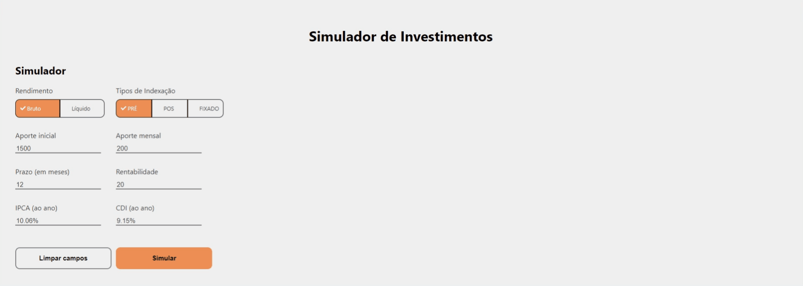
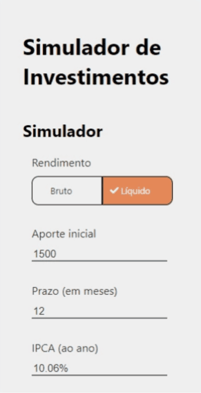

# Simulador de Investimentos

## Sobre

Este projeto foi criado utilizando o React como teste prático para a vaga de Desenvolvedor Fronted na empresa EQI Investimentos. O projeto foi criado seguindo as orientações presentes no repositório do link a seguir: https://github.com/eqi-investimentos/desafio-frontend 

O projeto é um simulador de investimentos, onde o usuário entra com valores de aporte inicial, prazo, aporte mensal e rentabilidade, além de selecionar o rendimento e, ao clicar no botão simular, o sistema retorna o resultado da simulação, contendo os valores de investimento e ganho e um gráfico.

As informações de IPCA e CDI presentes nos inputs de entrada são resultado de uma requisição para a API já disponibilizada pela empresa, assim como os resultados, que também são retornados a partir de uma requisição enviando o rendimento e o tipo de indexação selecionados pelo usuário.

## Tecnologias
+ React
+ JavaScript
+ HTML
+ CSS

## Funcionalidades

Ao abrir o sistema o usuário irá encontrar a tela presente na imagem a seguir, já com os valores de IPCA e CDI preenchidos, de acordo com a resposta da requisição GET feita ao backend, onde ele deverá selecionar o rendimento e o tipo de indexação e preencher os valores de aporte inicial, prazo, aporte mensal e rentabiliade. Os campos de IPCA e CDI não são editáveis.

Ao clicar no botão "Limpar campos" todos os campos preenchidos pelo usuários são limpados. A funcionalidade pode ser observada no gif a seguir.

Caso um dos valores digitados não seja numérico o sistema mostra um aviso dizendo que aquele campo deve ser um número, como na imagem abaixo

Com os dados preenchidos corretamente o usuário poderá clicar no botão "Simular" e o resultado aparecerá. Um exemplo é mostrado na imagem abaixo

## Responsividade

As imagens mostradas anteriormente são do projeto rodando em um desktop, porém é um sistema responsivo e, em dispositivos mobile, aparece como mostrrado a seguir

## Como executar

Primeiramente é necessário rodar o servidor backend presente no seguinte link: https://github.com/eqi-investimentos/desafio-fake-api

Faça o clone/download deste repositório e execute `npm install` para instalar as dependências do projeto.
Depois execute `npm start` e abra [http://localhost:3001](http://localhost:3001) para visualizar o sistema em seu navegador.